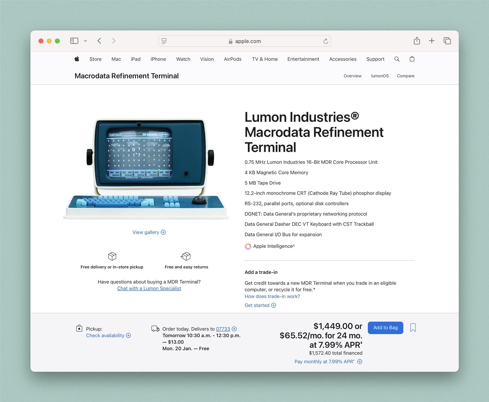

# Lumon Terminal Pro

This project came about after seeing concept screenshots online of what appeared like an Apple store front for one the _Severance_ terminals. 
Can't find the original author for appropriate credit but feel free to reach out if you are. 
Here's the concept: 

Afterwards, Apple themselves created a dedicated page on [apple.com](apple.com) as part of the promotion for their hit show _Severance_.
The page is no longer up but you can find it's [archive on the Wayback Machine](https://web.archive.org/web/20250402083313/https://www.apple.com/mac/lumon-terminal-pro/#expand).

This project aims to replicate the page with inspiration from the concept as well as the Apple page. 
